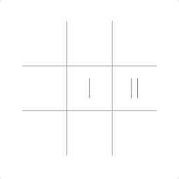

# 3xr - 3-in-a-row #
A web-based rendition of tic-tac-toe
## About ##
3xr, a rendition of tic-tac-toe, is designed to implement a simple, contemporary UI and cyclical gameplay (keeping score) for a better playing experience. Under the hood, functionality is implemented through a single `Game` object that renders the game and computes the logic after each turn, appended via prototype methods (e.g. `Game.prototype.drawBoard()`, `Game.prototype.checkWinnerStatus()`, `Game.prototype.endgame()`, etc.).

The basic user interface is built on the basic and iconic tic-tac-toe board, where, for the sake of minimalistic design and simplicity, the only information displays (score) and options (player count) are accessible via the middle right-most two cells of the board, still functional as usual spaces during gameplay.

In addition, as a result of the design of the game, there's no endpoint to restrict the user from playing to little or to much; in the spirit of minimalism but also practicality.
### Featureset ###
- [Player Count](#player-count)
- [Basic Logic](#basic-logic)
- [Score Keeping](#score-keeping)

## Gameplay ##

	
	

		<h3 id="player-count">Player Count</h3>
		
At the beginning of the game, the user has the option to choose between single and dual-player functionality. Singleplayer, denoted by "I", most obviously allows the user to play against the computer. Dual-player, "II", on the other hand, allows for the user to play against someone else on the same device.

	

	
	

		<h3 id="basic-logic">Basic Logic</h3>
		

			
Each time either one of the users or the computer makes a move, the game's logic is run to determine whether or not the winning conditions were met in order to follow its protocol (stop the game, cahce the score, display the game's score in the UI, and start a new game). Otherwise, the protocol is ignored and the game continues.

			
In the image on the left, the protocol is followed after and only after a winning condition is met, in this case, the bottom row has 3 X's.

		

	

	

		
On the other hand, however, if the game happens to be a draw (where there are no empty spaces left on the board to play), the game will end without either user winning (e.g. without their score count being incremented) and a new game will begin, with most up-to-date scores being cached, cyclically.

		
As depicted in the following image, the game is a draw (based on the outlined criterion) and the score does not update respectively.

	

	

	
	

		<h3 id="score-keeping">Score Keeping</h3>
		
Functionally, the approach taken in order to cache the player scores whilst also initializing a new game each time using the keyword <code>new Game()</code> and accepting the score as an argument that defines the object's score value.

		
Upon caching the score, however, it's printed in the game's UI, flashing the completed game, to denote that the game is over, and flashing the score (as depicted on the left).

	

